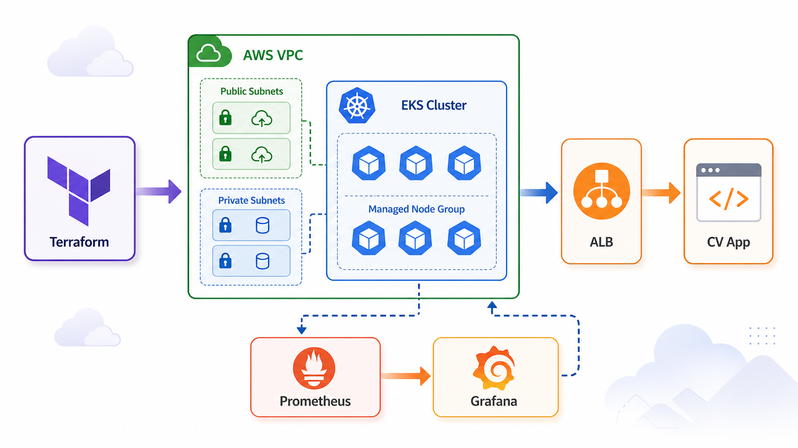

# Automating CV App Deployment on AWS EKS with Terraform, ALB, Prometheus, and Grafana



In this project, I used Terraform to provision an AWS EKS environment and deploy a containerized CV application behind an AWS Application Load Balancer. The setup also includes the AWS Load Balancer Controller and a monitoring stack with Prometheus and Grafana.

The goal was simple: create repeatable infrastructure that can bring up networking, Kubernetes, load balancing, and observability with a small set of Terraform commands.

## What This Project Builds

The Terraform configuration provisions:

- A custom VPC in `ap-south-1`.
- Public and private subnets across multiple Availability Zones.
- Internet Gateway, NAT Gateway, route tables, and subnet associations.
- An Amazon EKS cluster.
- A managed EKS node group.
- IAM roles and policies for the cluster, node group, and AWS Load Balancer Controller.
- OIDC integration for Kubernetes service account permissions.
- AWS Load Balancer Controller installed through Helm.
- A CV application exposed through an ALB ingress.
- Prometheus and Grafana for monitoring.

## Repository Structure

The repository is organized into root Terraform files and reusable modules:

```text
.
├── main.tf
├── provider.tf
├── variable.tf
├── modules
│   ├── vpc
│   └── eks
└── README.md
```

The `vpc` module owns the network layer. The `eks` module owns the Kubernetes control plane, node group, IAM, OIDC, and load balancer controller setup.

## Terraform Workflow

The infrastructure can be created with the standard Terraform workflow:

```sh
terraform init
terraform plan -var='aws_profile=default' -out=tfplan
terraform apply tfplan
```

Or directly:

```sh
terraform apply -auto-approve -var='aws_profile=default'
```

The `aws_profile` variable is important because the project updates kubeconfig after the cluster is created.

## Updating Kubeconfig

After EKS is available, kubeconfig can be refreshed manually:

```sh
aws eks update-kubeconfig --name eks --region ap-south-1 --profile default
```

Then cluster access can be verified:

```sh
kubectl get nodes
kubectl get pods -A
```

In my deployment, the cluster became active and the managed node joined successfully.

## Exposing the CV App with an ALB

The CV app runs in the `cv` namespace and is exposed through an AWS ALB ingress.

To find the endpoint:

```sh
kubectl get ingress -n cv
```

Example output:

```text
NAME        CLASS   HOSTS   ADDRESS                                                            PORTS
cv-cv-app   alb     *       k8s-myappgroup-430fe4898e-912724151.ap-south-1.elb.amazonaws.com   80
```

The app can then be opened through the ALB:

```text
http://k8s-myappgroup-430fe4898e-912724151.ap-south-1.elb.amazonaws.com
```

I verified the endpoint returned `HTTP/1.1 200 OK`.

## Monitoring with Grafana

Grafana is installed in the `cv` namespace as a ClusterIP service:

```sh
kubectl get svc cv-grafana -n cv
```

Since it is not exposed publicly, the safest way to access it locally is with port forwarding:

```sh
kubectl -n cv port-forward svc/cv-grafana 3000:80
```

Then open:

```text
http://localhost:3000
```

Credentials can be retrieved from the Kubernetes secret:

```sh
kubectl get secret cv-grafana -n cv -o jsonpath='{.data.admin-user}' | base64 --decode; echo
kubectl get secret cv-grafana -n cv -o jsonpath='{.data.admin-password}' | base64 --decode; echo
```

## Troubleshooting Notes

One issue I hit was a stale kubeconfig context from an older EKS cluster. The old endpoint no longer resolved, so Kubernetes clients failed with DNS lookup errors.

The fix was to inspect contexts:

```sh
kubectl config get-contexts
```

Then remove the stale context, cluster, and user:

```sh
kubectl config delete-context <old-context>
kubectl config delete-cluster <old-cluster>
kubectl config delete-user <old-user>
```

Finally, I refreshed kubeconfig for the current cluster:

```sh
aws eks update-kubeconfig --name eks --region ap-south-1 --profile default
```

## Cleanup

When the environment is no longer needed, Terraform can destroy the resources:

```sh
terraform destroy -var='aws_profile=default'
```

This removes the EKS cluster, node group, VPC networking, IAM resources, and load balancer resources.

## Final Thoughts

Terraform makes this kind of EKS deployment repeatable and easier to reason about. With the VPC, EKS cluster, ALB ingress, and monitoring stack defined as code, the environment can be recreated, reviewed, and destroyed consistently.

The full project is available on GitHub:

```text
https://github.com/rashmilkukreja/Terraform-eks-with-lb
```
